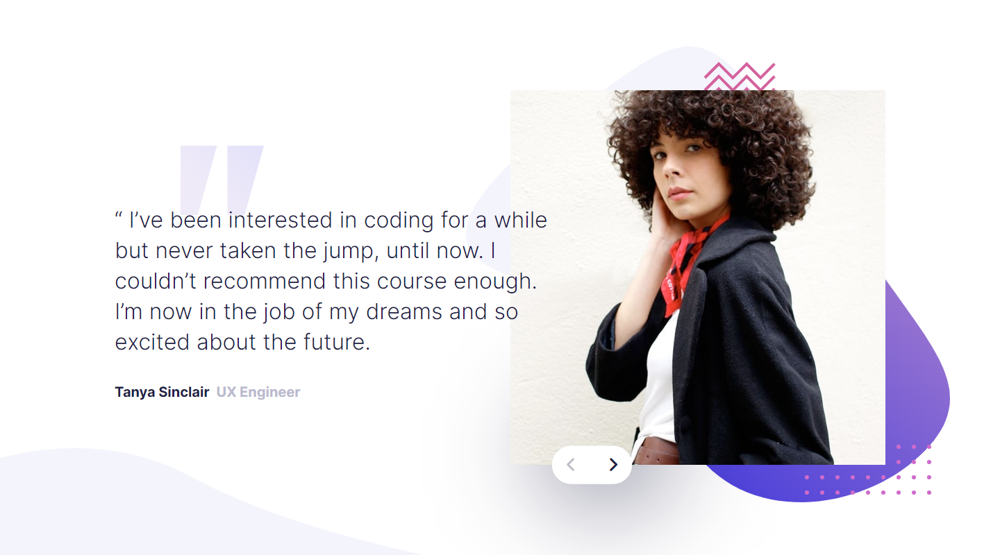

# Frontend Mentor - Coding bootcamp testimonials slider solution

This is a solution to the [Coding bootcamp testimonials slider challenge on Frontend Mentor](https://www.frontendmentor.io/challenges/coding-bootcamp-testimonials-slider-4FNyLA8JL). Frontend Mentor challenges help you improve your coding skills by building realistic projects. 

## Table of contents

- [Overview](#overview)
  - [The challenge](#the-challenge)
  - [Screenshot](#screenshot)
  - [Links](#links)
- [My process](#my-process)
  - [Built with](#built-with)
  - [What I learned](#what-i-learned)
  - [Continued development](#continued-development)
  - [Useful resources](#useful-resources)
- [Author](#author)
- [Acknowledgments](#acknowledgments)

## Overview

### The challenge

Users should be able to:

- View the optimal layout for the component depending on their device's screen size
- Navigate the slider using either their mouse/trackpad or keyboard

### Screenshot

### Links

- Solution URL: [Coding bootcamp testimonials slider solution](https://github.com/MoeHtetMyint99/coding-bootcamp-testimonials-slider)
- Live Site URL: [Coding bootcamp testimonials slider solution](https://moehtetmyint99.github.io/coding-bootcamp-testimonials-slider/)

## My process

### Built with

- Semantic HTML5 markup
- CSS custom properties
- Flexbox

## Author

- Frontend Mentor - [@MoeHtetMyint99](https://www.frontendmentor.io/profile/MoeHtetMyint99)
- Facebook - [Moe Htet Myint](https://www.facebook.com/profile.php?id=100023408299983)
- Github - [MoeHtetMyint99](https://github.com/MoeHtetMyint99/)

